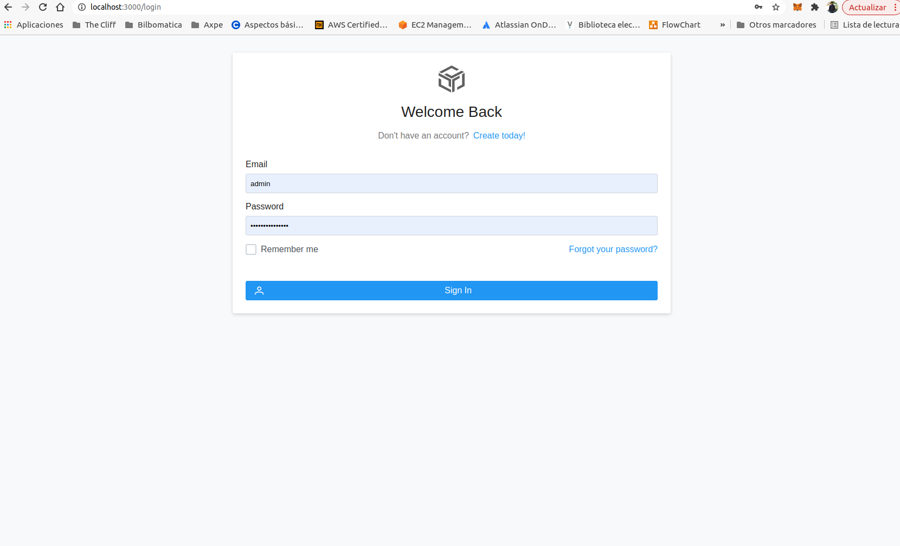
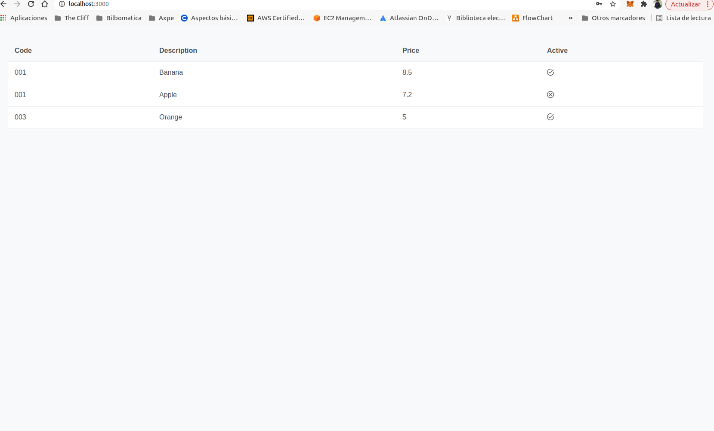

# Description

Poc Outh2/OpenID Frontend React Microservice

## Create react javascript project

```shell
npx create-react-app poc-olive-front-react
```

## Install react and PrimeReact dependencies

```shell
npm install react-transition-group --save
npm install react-router-dom --save
npm install axios --save
npm install primereact --save
npm install primeicons --save
npm install primeflex --save
npm install jwt-decode --save
```

## Start project

```shell
npm start
```

## Select the backend service

To select the business backend service to used from the front change to load produthe uri from ProductService.js

```javascript
// select a microservice to get products
//const API_AUTH_URL = "http://localhost:8082/api/"; //SpringBoot Microservice
//const API_AUTH_URL = "https://localhost:8000/api/"; // PHP Microservice
const API_AUTH_URL = "http://localhost:8001/"; // Python Microservice
```

## App Views

Login View



Products View 


